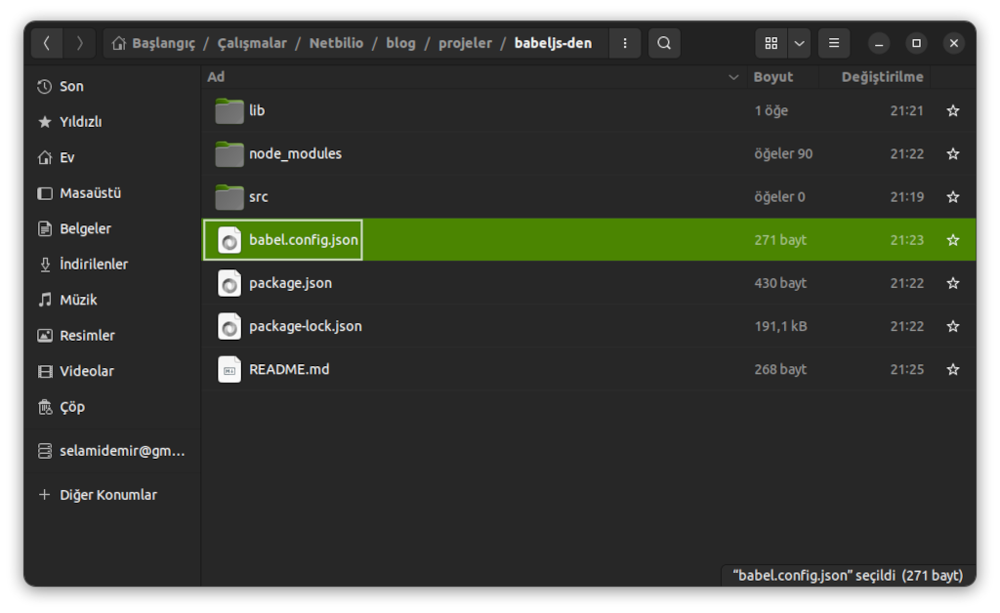

# Babel JS Nedir? Nasıl Kullanılır?

[Netbilio](https://netbilio.com) üzerinde yayınlamış olduğumuz Babel JS Nedir? Nasıl Kullanılır? yazı ile ilgili olan kodları bu repoda bulabilirsiniz. 

Uygulamanın açıklamasını web safaysından okuyabilirsiniz. [Babel Js Nedir? Nasıl Kullanılır?](https://netbilio.com/babel-js-nedir-nasil-kullanilir)



Uygulamayı bilgisayarınıza indirdiğinizde, babeljs-den klasörü içerisinde (konsoldan)

```
npm init

```

komutunu çalıştırın. Gerekli dosyalar kurulduktan sonra 

```
npm run build

```

komutu ile **src** klasörü içerisindeki **app.js** dosyası build edilecek ve **lib** klasörü içerisinde eski sürüm tarayıcılar ile uyumlu olan javascript kodunu içeren **app.js** dosyası oluşturulacaktır.

Daha ayrıntılı bilgi için [Babel Js Nedir? Nasıl Kullanılır?](https://netbilio.com/babel-js-nedir-nasil-kullanilir) sayfasını ziyaret ediniz.